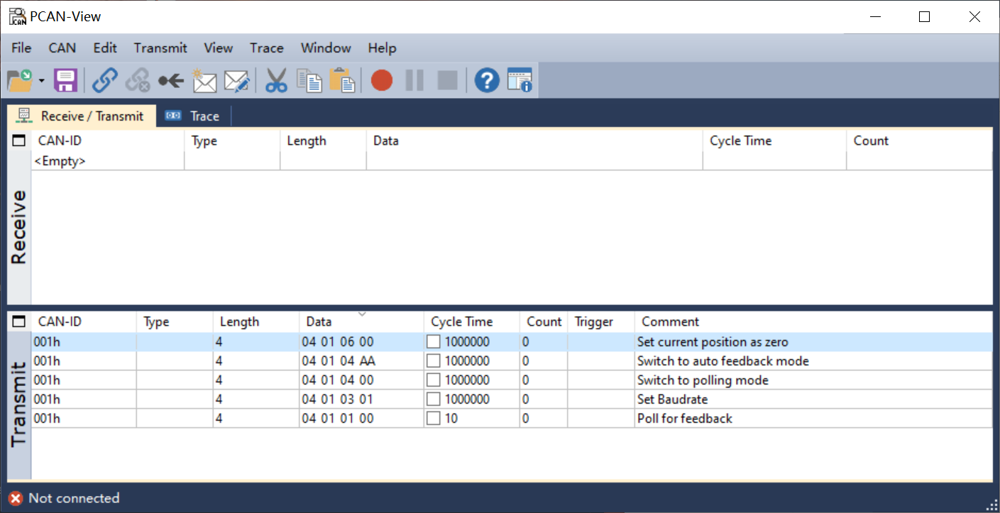

# BRT50 Encoder Driver
Simulink driver for BRITTER BRT50 series encoder.

## Requirements
* PCAN USB2CAN
* Vehicle Network Toolbox Support Package for PEAK-System CAN Devices

## quick setup
We recommand using PCAN-VIEW to setup the operation mode of the encoder. Start PCAN-VIEW and load configurations from `./setup/COM32768D1.xmt`. 

  

